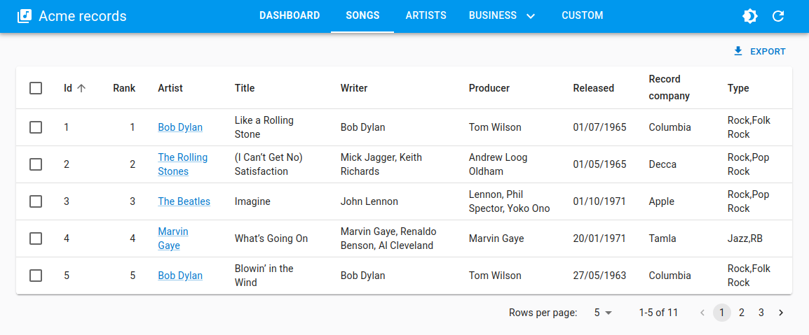

# `<HorizontalMenu>`

A horizontal menu component, alternative to react-admin's `<Menu>`, to be used in the AppBar of the `<ContainerLayout>`.



## Usage

Create a menu component based on `<HorizontalMenu>` and `<HorizontalMenu.Item>` (or `<HorizontalMenu.DashboardItem>`) children. Each child should have a `value` corresponding to the [application location](https://react-admin-ee.marmelab.com/documentation/ra-navigation#concepts) of the target, and can have a `to` prop corresponding to the target location if different from the app location.

```jsx
import { HorizontalMenu } from '@react-admin/ra-navigation';

export const Menu = () => (
    <HorizontalMenu>
        <HorizontalMenu.DashboardItem label="Dashboard" value="" />
        <HorizontalMenu.Item label="Songs" to="/songs" value="songs" />
        <HorizontalMenu.Item label="Artists" to="/artists" value="artists" />
    </HorizontalMenu>
);
```

Then pass it to the `<ContainerLayout>`:

```jsx
import { Admin, Resource } from 'react-admin';
import { ContainerLayout } from '@react-admin/ra-navigation';

import { Menu } from './Menu';

const MyLayout = ({ children }) => (
    <ContainerLayout menu={<Menu />}>
        {children}
    </ContainerLayout>
);

const App = () => (
    <Admin dataProvider={dataProvider} layout={MyLayout}>
        ...
    </Admin>
);
```

## Prop

| Prop           | Required | Type      | Default     | Description                                                                              |
| -------------- | -------- | --------- | ----------- | ---------------------------------------------------------------------------------------- |
| `hasDashboard` | Optional | Boolean   |             | Display an `<HorizontalMenu.DashboardItem>` with your resources if no children specified |

It also accept the props of [MUI Tabs](https://mui.com/material-ui/api/tabs/#props).

## `hasDashboard`

When you're using `<HorizontalMenu>` without any child, it detects your resources and adds dedicated `<HorizontalMenu.Item>` components for you. You can specify that you want a `<HorizontalMenu.DashboardItem>` with it thanks to the `hasDashboard` prop.

```tsx
import { ContainerLayout, HorizontalMenu } from '@react-admin/ra-navigation';

const MyLayout = ({ children }) => (
    <ContainerLayout menu={<HorizontalMenu hasDashboard />}>
        {children}
    </ContainerLayout>
);
```

## `<HorizontalMenu.Item>`

An item for the `<HorizontalMenu>` component. Used to define access to a resource or a custom route.

```tsx
<HorizontalMenu>
    <HorizontalMenu.DashboardItem label="Home" />
    <HorizontalMenu.Item label="Artists" to="/artists" value="artists" />
    <HorizontalMenu.Item label="Songs" to="/songs" value="songs" />
    <HorizontalMenu.Item label="Labels" to="/labels" value="labels" />
</HorizontalMenu>
```

### Props

| Prop            | Required | Type      | Default     | Description                                                                                                          |
| --------------- | -------- | --------- | ----------- | -------------------------------------------------------------------------------------------------------------------- |
| `value`         | Required | string    |             | The value of the Tab and the default route to use if no `to` is provided                                             |
| `label`         | Optional | string    |             | The text to display                                                                                                  |
| `to`            | Optional | string    |             | The route to which the item redirects                                                                                |
| `TabProps`      | Optional | [TabProps](https://mui.com/material-ui/api/tabs/#props)  |  | Additional props of the Tab                                                      |
| `MenuProps`     | Optional | [MenuProps](https://mui.com/material-ui/api/menu/#props)  |  | Additional props of the Menu (`HorizontalMenu.Item` with children)              |
| `MenuItemProps` | Optional | [MenuItemProps](https://mui.com/material-ui/api/menu-item/#props)  |  | Additional props of the MenuItem (children of a `HorizontalMenu.Item`) |

### `value`

The `value` passed to the [MUI `Tab`](https://mui.com/material-ui/react-tabs/):

```tsx
<HorizontalMenu>
    <HorizontalMenu.Item value="artists" />
    <HorizontalMenu.Item value="songs" />
</HorizontalMenu>
```

### `label`

You can customize the label by setting the `label` prop. It is inferred from the `value` prop by default.

`<HorizontalMenu.Item>` uses the i18n layer, so you can translate the label. Check [the Translation chapter](./TranslationTranslating.md) for more information.

```tsx
<HorizontalMenu>
    <HorizontalMenu.Item label="Artists" value="artists" />
    <HorizontalMenu.Item label="ra.custom.path.resource.song" value="songs" />
</HorizontalMenu>
```

### `to`

You can customize the link of your resource by setting the `to` prop. It is inferred from the `value` prop by default as ``/${value}``.

```tsx
<HorizontalMenu>
    <HorizontalMenu.Item to="/artists" value="artists" />
    <HorizontalMenu.Item to="/musics" value="songs" />
</HorizontalMenu>
```

### `TabProps`

Additional props passed to the [Tab](https://mui.com/material-ui/api/tabs/#props).



```tsx
import { HorizontalMenu } from '@react-admin/ra-navigation';
import MusicNoteIcon from '@mui/icons-material/MusicNote';

const Menu = () => (
    <HorizontalMenu>
        <HorizontalMenu.Item 
            value="songs"
            TabProps={{ icon: <MusicNoteIcon />, iconPosition: 'start' }}
        />
    </HorizontalMenu>
);
```



### `MenuProps`

Additional props passed to the [Menu](https://mui.com/material-ui/api/menu/#props) (item displayed if it has children).



```tsx
<HorizontalMenu>
    <HorizontalMenu.Item 
        value="songs"
        MenuProps={{ open: true, autoFocus: true }}
    >
        <HorizontalMenu.Item value="albums" />
        <HorizontalMenu.Item value="singles" />
    </HorizontalMenu.Item>
</HorizontalMenu>
```



### `MenuItemProps`

Additional props passed to the [MenuItem](https://mui.com/material-ui/api/menu-item/#props) (item displayed in a sub-menu).



```tsx
<HorizontalMenu>
    <HorizontalMenu.Item value="songs">
        <HorizontalMenu.Item 
            value="albums"
            MenuItemProps={{
                divider: true,
                selected: isSelected(),
            }}
        />
        <HorizontalMenu.Item value="singles" />
    </HorizontalMenu.Item>
</HorizontalMenu>
```



### Adding Sub-Menus

<video controls autoplay playsinline muted loop>
  <source src="https://react-admin-ee.marmelab.com/assets/horizontal-menu-submenu.mp4" type="video/mp4"/>
  Your browser does not support the video tag.
</video>

`<HorizontalMenu.Item>` creates a menu item for a given path. But you can also add `<HorizontalMenu.Item>` components as a child to create a submenu.

```jsx
<HorizontalMenu>
    <HorizontalMenu.DashboardItem label="Home" />
    <HorizontalMenu.Item label="artists" to="/artists" value="artists" />
    <HorizontalMenu.Item label="Business" value="business">
        <HorizontalMenu.Item label="Producers" to="/producers" value="producers" />
        <HorizontalMenu.Item label="Label" to="/label" value="label" />
    </HorizontalMenu.Item>
    <HorizontalMenu.Item label="songs" to="/songs" value="songs" />
</HorizontalMenu>
```

## `<HorizontalMenu.DashboardItem>`

This component adds a menu item that redirects to the `/` route. It accepts the same props as [`<HorizontalMenu.Item>`](#horizontalmenuitem).

```tsx
<HorizontalMenu.DashboardItem value="" />
```
