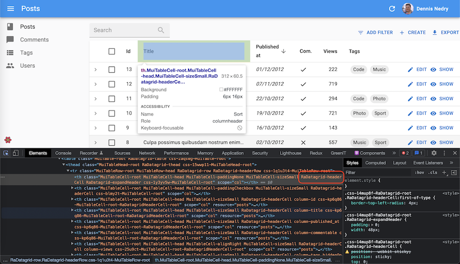
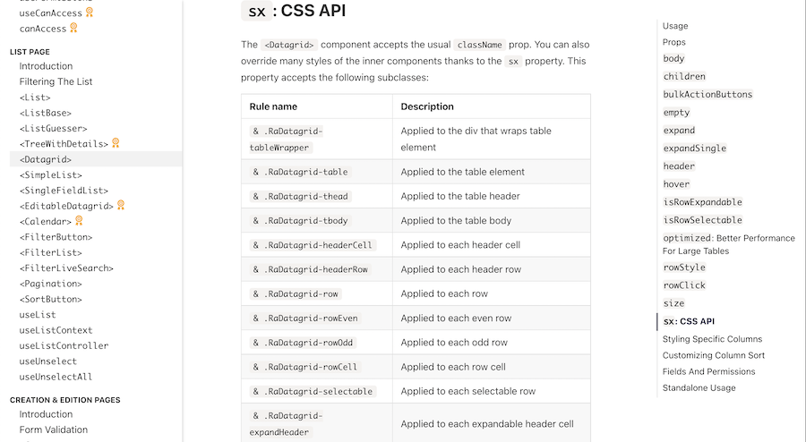

# The `sx` prop

All react-admin components expose an `sx` prop, which allows to customize the component style. This `sx` prop is kind of like [React's `style` prop](https://react.dev/reference/react-dom/components/common#applying-css-styles), but it's more powerful. It uses the CSS-in-JS solution offered by MUI, [MUI System](https://mui.com/system/basics/#the-sx-prop), powered by [emotion](https://emotion.sh/docs/introduction). 

## Syntax

The `sx` prop accepts an object with CSS properties as keys and values, just like the `style` prop. It uses the JavaScript name of CSS properties (e.g. `fontWeight` instead of `font-weight`).


```jsx
import { NumberField, List, DataTable, EditButton } from 'react-admin';

export const ProductList = () => (
    <List>
        <DataTable>
            <DataTable.Col source="sku" />
            <DataTable.Col source="price" />
            <DataTable.Col field={EditButton} sx={{ fontWeight: "bold" }}/>
        </DataTable>
    </List>
);
```


In the rendered HTML, this will result in a custom class name, like `EditButton-root-123`. This class name will be added to the DOM element, and the corresponding CSS will be injected in the `<head>` of the document.

The `sx` prop supports CSS syntax including child and pseudo-selectors, media queries, raw CSS values, and more.

Here is another example, taken from the [CRM demo](https://github.com/marmelab/react-admin/blob/master/examples/crm/src/dashboard/Welcome.tsx):


```jsx
export const Welcome = () => (
    <Card
        sx={{
            background: `#c5dedd`,
            color: 'rgba(0, 0, 0, 0.87)',
            p: 1,
            mb: 1,
            mt: 2,
            [`& .MuiCardActions-root`]: {
                p: 2,
                mt: -2,
                mb: -1,
                flexDirection: 'column',
                '& a': {
                    mb: 1,
                    color: 'rgba(0, 0, 0, 0.87)',
                    backgroundColor: 'white',
                    marginLeft: '0 !important',
                },
            },
        }}
    >
        // ...
    </Card>
);
```


You can use any CSS property (see the [list of all accepted CSS properties](https://mui.com/system/properties/) in the MUI documentation). Take advantage of IDE autocompletion to discover the available properties.

## Shorthand Properties

The `sx` prop accepts shorthand properties, like `m` for `margin` or `mt` for `marginTop`:


```jsx
<Box
  sx={{
    m: 1, // margin: theme.spacing(1)
    px: 1, // padding-left, padding-right: theme.spacing(1)
  }}
>
```


Common shorthands are:

- `m`: `margin`
- `mt`:	`margin-top`
- `mr`:	`margin-right`
- `mb`:	`margin-bottom`
- `ml`:	`margin-left`
- `mx`:	`margin-left, margin-right`
- `my`:	`margin-top, margin-bottom`
- `p`: `padding`
- `pt`:	`padding-top`
- `pr`:	`padding-right`
- `pb`:	`padding-bottom`
- `pl`:	`padding-left`
- `px`:	`padding-left, padding-right`
- `py`:	`padding-top, padding-bottom`
- `bgcolor`: `backgroundColor`

## Theme-Aware Values

Some CSS properties accept theme-aware values, i.e. the sx to CSS conversion uses the application theme. Check [the material-ui default theme](https://mui.com/material-ui/customization/default-theme/) for the list of values you can use. 

The `typography` property can receive a string, which represents the path in `theme.typography`:


```jsx
<Box sx={{ typography: 'subtitle2' }} /> // theme.typography.subtitle2
<Box sx={{ typography: 'body1' }} />
<Box sx={{ typography: 'body2' }} />
``` 


The `color` and `backgroundColor` properties can receive a string, which represents the path in `theme.palette`:


```jsx
<Box sx={{ color: 'primary.main' }} />
// equivalent to color: theme => theme.palette.primary.main
<Box sx={{ color: 'secondary.main' }} />
<Box sx={{ color: 'error.main' }} />
<Box sx={{ color: 'warning.main' }} />
<Box sx={{ color: 'info.main' }} />
<Box sx={{ color: 'success.main' }} />
<Box sx={{ color: 'text.primary' }} />
<Box sx={{ color: 'text.secondary' }} />
<Box sx={{ color: 'text.disabled' }} />
```


The value of sizing properties `width`, `height`, `minHeight`, `maxHeight`, `minWidth`, and `maxWidth` is converted to a percentage if it is between `[0, 1]`. Otherwise, it is directly set on the CSS property:


```jsx
<Box sx={{ width: 1/2 }} /> // equivalent to width: '50%'
<Box sx={{ width: 20 }} /> // equivalent to width: '20px'
```


The spacing properties `margin`, `padding`, and the corresponding longhand properties multiply the values they receive by the `theme.spacing` value (the default for the value is 8px):


```jsx
<Box sx={{ margin: 2 }} />
// equivalent to margin: theme => theme.spacing(2)
```


The `fontFamily`, `fontSize`, `fontStyle`, `fontWeight` properties map their value to the `theme.typography` value:


```jsx
<Box sx={{ fontWeight: 'fontWeightLight' }} />
// equivalent to fontWeight: theme.typography.fontWeightLight
```


## Responsive Values

The `sx` prop simplifies the process of defining and implementing responsive breakpoints. You can define a set of breakpoints as an object, using the breakpoint values as keys. 


```jsx
<Box
  sx={{
    width: {
      xs: 100, // theme.breakpoints.up('xs')
      sm: 200, // theme.breakpoints.up('sm')
      md: 300, // theme.breakpoints.up('md')
      lg: 400, // theme.breakpoints.up('lg')
      xl: 500, // theme.breakpoints.up('xl')
    },
  }}
>
  This box has a responsive width.
</Box>
```


Note that each property for a given breakpoint also applies to all larger breakpoints in the set. For example, `width: { lg: 100 }` is equivalent to `theme.breakpoints.up('lg')`.

You can use this syntax to show or hide a component based on the screen size:

- Hidden on all: `sx={{ display: 'none' }}`
- Hidden only on xs: `sx={{ display: { xs: 'none', sm: 'block' } }}`
- Hidden only on sm: `sx={{ display: { xs: 'block', sm: 'none', md: 'block' } }}`
- Hidden only on md: `sx={{ display: { xs: 'block', md: 'none', lg: 'block' } }}`
- Hidden only on lg: `sx={{ display: { xs: 'block', lg: 'none', xl: 'block' } }}`
- Hidden only on xl: `sx={{ display: { xs: 'block', xl: 'none' } }}`
- Visible only on xs: `sx={{ display: { xs: 'block', sm: 'none' } }}`
- Visible only on sm: `sx={{ display: { xs: 'none', sm: 'block', md: 'none' } }}`
- Visible only on md: `sx={{ display: { xs: 'none', md: 'block', lg: 'none' } }}`
- Visible only on lg: `sx={{ display: { xs: 'none', lg: 'block', xl: 'none' } }}`
- Visible only on xl: `sx={{ display: { xs: 'none', xl: 'block' } }}`

## Media Queries

You can use media queries in the `sx` prop:


```jsx
<Box
  sx={{
    // some styles
    '@media print': {
      width: 300,
    },
  }}
>
```


**Tip**: Don't use media queries for responsive values. Use the [responsive values syntax](#responsive-values) instead.

**Tip**: The `displayPrint` property allows you to specify a CSS display value that will only be applied when printing:


```jsx
<Box sx={{ displayPrint: 'none' }} /> // equivalent to '@media print': { display: 'none' }
```


## Pseudo-Classes

You can use pseudo-classes to style a component only when it's in a specific state. For instance, you can use the `:hover` pseudo-class to style a component when the mouse is over it:


```jsx
<Box
  sx={{
    // some styles
    ":hover": {
      boxShadow: 6,
    },
  }}
>
```


Common pseudo-classes used for styling are `:hover`, `:disabled`, `:active`, `:focus`, `:first-child`, `:last-child`. Check [the list of CSS pseudo classes](https://developer.mozilla.org/en-US/docs/Web/CSS/Pseudo-classes) for more information.

## Styling Children

The real power of the `sx` prop is that it allows to override the style of sub-components. For instance, you can use it to style the `<Avatar>` inside another element:


```jsx
const CustomUserCard = ({ user }) => (
    <UserCard
        user={user}
        sx={{
            display: 'flex',
            alignItems: 'center',
            '& .MuiAvatar-root': {
                width: 48,
                height: 48,
                mr: 1,
            },
        }}
    />
);
```


Here is another example, illustrating the ability to customize the header of a `<DataTable>`:


```jsx
import {
    BooleanField,
    DataTable,
    DateField,
    EditButton,
    List,
    ShowButton,
} from 'react-admin';
import Icon from '@mui/icons-material/Person';

export const VisitorIcon = Icon;

export const PostList = () => (
    <List>
        <DataTable
            sx={{
                backgroundColor: "Lavender",
                "& .RaDataTable-headerCell": {
                    backgroundColor: "MistyRose",
                },
            }}
        >
            <DataTable.Col source="id" />
            <DataTable.Col source="title" />
            <DataTable.Col source="published_at">
                <DateField source="published_at" sortByOrder="DESC" />
            </DataTable.Col>
            <DataTable.Col source="commentable">
                <BooleanField source="commentable" sortable={false} />
            </DataTable.Col>
            <DataTable.Col source="views">
                <NumberField source="views" sortByOrder="DESC" />
            </DataTable.Col>
            <DataTable.Col field={EditButton} />
            <DataTable.Col field={ShowButton} />
        </DataTable>
    </List>
);
```


This example results in:


To guess the name of the subclass to use (like `.RaDataTable-headerCell` above) for customizing a component, you can use the developer tools of your browser:



The react-admin documentation for individual components also lists the classes available for styling. For instance, here is the [DataTable CSS documentation](./DataTable.md#sx-css-api):



## Callback Values

Each property in the sx prop can receive a function callback as a value. This is useful when you want to use the theme for calculating a value:


```jsx
<Box sx={{ height: (theme) => theme.spacing(10) }} />
```


The `sx` prop can also receive a callback when you need to get theme values that are objects:


```jsx
<Box
  sx={(theme) => ({
    ...theme.typography.body,
    color: theme.palette.primary.main,
  })}
/>
```


**Tip**: If you use TypeScript, you'll have to specify the type of the theme in the callback:


```tsx
import { Box, Theme } from '@mui/material';

export const MyComponent = () => (
    <Box
    sx={{
        p: 1,
        border: 1,
        borderColor: (theme: Theme) => theme.palette.primary.main,
    }}
    >
    Border color with theme value.
    </Box>
)
``` 


## Conditional Formatting

Sometimes you want the format to depend on the value. Use `useRecordContext` to grab the record in a component, and the `sx` prop to apply the format.

The following example shows how to create a new `<ColoredNumberField>` component, which renders with red text when its value is less than 0.


```tsx
import { useRecordContext, NumberField, List, DataTable, EditButton } from 'react-admin';
import type { NumberFieldProps } from 'react-admin';

const ColoredNumberField = (props: NumberFieldProps) => {
    const record = useRecordContext();
    return (
        <NumberField
            sx={{ color: record[prop.source] < 0 ? 'red' : 'black' }}
            {...props}
        />
    );
};

// Ensure the original component defaultProps are still applied as they may be used by its parents (such as the `Show` component):
ColoredNumberField.defaultProps = NumberField.defaultProps;

export const PostList = () => (
    <List>
        <DataTable>
            <DataTable.Col source="id" />
            ...
            <DataTable.Col source="nb_views" field={ColoredNumberField} />
            <DataTable.Col field={EditButton} />
        </DataTable>
    </List>
);
```


**Tip**: if you don't want to create a custom component to apply conditional formatting, you can also use [the `<WithRecord>` component](./WithRecord.md).

## Reusable Components

To reuse the same style overrides in different locations across your application, create a reusable component using [the Material UI `styled()` utility](https://mui.com/system/styled/). It's a function that creates a new component based on a source component and custom styles. The basic syntax is `styled(Component)(styles) => Component` (where `styles` follows the same syntax as the `sx` prop).

For instance, to create a custom `<DataTable>` component with the header style defined in the previous section:

```jsx
// in src/MyDataTable.js
import { styled } from '@mui/system';
import { DataTable } from 'react-admin';

export const MyDataTable = styled(DataTable)({
    backgroundColor: "Lavender",
    "& .RaDataTable-headerCell": {
        backgroundColor: "MistyRose",
    },
});
```

You can then use this component instead of react-admin's `<DataTable>` component:


```diff
// in src/post/PostList.js
import {
    BooleanField,
-   DataTable,
    DateField,
    EditButton,
    List,
    ShowButton,
} from 'react-admin';
+import { MyDataTable } from '../MyDataTable';

export const PostList = () => (
    <List>
-       <DataTable
-           sx={{
-               backgroundColor: "Lavender",
-               "& .RaDataTable-headerCell": {
-                   backgroundColor: "MistyRose",
-               },
-           }}
-       >
+       <MyDataTable>
            <DataTable.Col source="id" />
            <DataTable.Col source="title" />
            <DataTable.Col source="published_at">
                <DateField source="published_at" sortByOrder="DESC" />
            </DataTable.Col>
            <DataTable.Col source="commentable">
                <BooleanField source="commentable" sortable={false} />
            </DataTable.Col>
            <DataTable.Col source="views">
                <NumberField source="views" sortByOrder="DESC" />
            </DataTable.Col>
            <DataTable.Col field={EditButton} />
            <DataTable.Col field={ShowButton} />
+       </MyDataTable>
-       </DataTable>
    </List>
);
```


Again, to guess the name of the subclass to use (like `.RaDataTable-headerCell` above) for customizing a component, you can use the developer tools of your browser, or check the react-admin documentation for individual components (e.g. the [DataTable CSS documentation](./DataTable.md#sx-css-api)).

## Going Further

Check [The Material UI documentation on the `sx` prop](https://mui.com/system/getting-started/the-sx-prop/) for more information.


